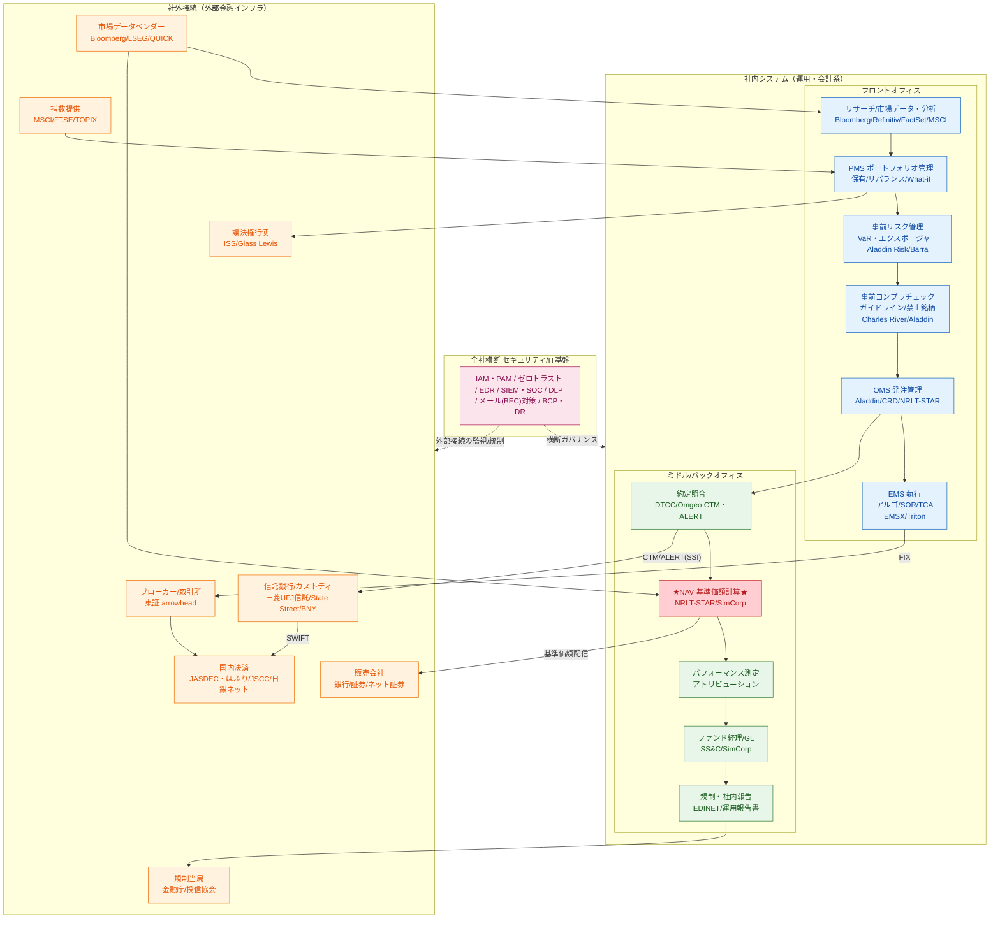

# アセットマネジメント システム構成図

> 面接対策用のサンプル構成図。内部（フロント→ミドル→バック）と外部金融インフラ接続、横断セキュリティ基盤を1枚に。
> 画像版: `asset_mgmt_system_diagram.png` / 編集用ソース: `asset_mgmt_system_diagram.mmd`

## 凡例
- 🔵 **フロントオフィス**：投資判断〜発注〜執行（リサーチ→PMS→リスク→コンプラ→OMS→EMS）
- 🟢 **ミドル/バックオフィス**：約定照合→**NAV計算**→パフォーマンス→経理→報告
- 🔴 **NAV（基準価額計算）**＝生命線。停止＝取引停止、改ざん＝全投資家に不当価格
- 🟠 **社外接続**：FIX（発注）/ SWIFT（決済）/ CTM・ALERT（照合）/ データ・指数 / 販売会社 / 規制 / 議決権
- 🩷 **横断セキュリティ基盤**：IAM・PAM / ゼロトラスト / EDR / SIEM・SOC / DLP / BCP

## 主要な接続プロトコル
- **FIX** … EMS/OMS → ブローカー/取引所（発注・約定）
- **SWIFT** … カストディ/信託銀行 → 国内外決済（資金・証券決済指図）
- **CTM/ALERT(SSI)** … 約定照合・決済先口座情報
- **基準価額配信** … NAV → 販売会社 → 個人/法人顧客
